# Co-Operation Multi-Turn | Group 1 | Level Design — Oscar Kennedy

## Level Design

The level design component of this project involved the manual creation of 10 playable levels for Co-Operation Multi-Turn, a cooperative turn-based hospital puzzle game. Each level is defined entirely in YAML and must be provided in three variants — one each for two-, three-, and four-player sessions — giving 30 individual level files in total. This section documents the design approach, the technical structure of those files, the step-by-step process used to construct each level, and the player-count adaptation strategy employed across all 10 levels.

### Role and Contribution

Oscar Kennedy served as Lead Level Designer for the group. The primary deliverables for this role were:

- Six complete, playable levels (18 YAML files) for the FinalPackage collection.
- (2 levels made by Mervin, 1 by David and 1 by Harrison for 10 levels total).
- An updated package.yaml registering all levels with appropriate unlock conditions and player-count file mappings.
- A structured, step-by-step design methodology documented for use as training data for future AI level generation.
- Initial discovery and documentation of the project folder structure, allowing the wider team to understand how the game engine loads custom content.

The first level was created on 1 December, establishing the folder structure, file naming conventions, and core workflow that all subsequent levels followed.

### How the Game Loads Levels

Co-Operation Multi-Turn provides a MakeYourOwnLevel folder inside the game's StreamingAssets directory, along with existing art and sound assets from the main game. Custom levels are placed in a PlayerPackages subdirectory alongside a package.yaml master configuration file.

The package.yaml file serves as the table of contents for the entire collection. It defines:

- The ordered list of all levels and their display names.
- Which YAML file to load for each player count (2, 3, or 4 players).
- The rank-based unlock system that gates later levels behind progression.
- The setup stages players navigate before each game (level selection and game mode selection).

The game engine reads this file at startup and uses it to populate the level-select carousel. Individual level YAML files are loaded on demand when a level is selected. The only file that must be edited when adding a new level is package.yaml; the level files themselves are self-contained.

*Figure: Package folder structure — PlayerPackages directory layout*

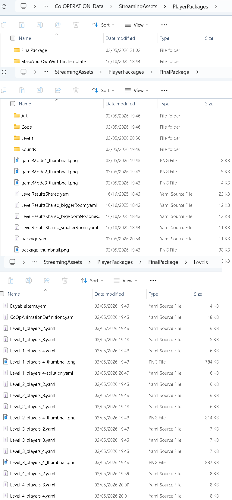

### Level File Structure

Every level YAML file follows a consistent schema with five functional sections:

| **Section** | **Purpose** |
|---|---|
| **include** | References LevelsShared.yaml, which provides the full library of available object types (floors, walls, items, decorations). |
| **sceneName** | Specifies the Unity background scene to render (e.g. OriginalWorld). |
| **grid** | A multi-line ASCII string that names every active tile on the map using two-character coordinates (e.g. g8, f9). Blank tiles are written as `__`. |
| **gridObjects** | Maps each grid coordinate to an array of objects — floors, patients, items, walls, and decorations — placed at that position. |
| **globalData** | Defines every patient's health, treatment requirement (pill, syringe, or apple), optional spawn turn, and character model. |

### The Grid and Coordinate System

The grid uses a two-character alphanumeric coordinate system. The first character denotes the column (a–z, continuing as A–Z for extended grids) and the second denotes the row using the same sequence. For example, `g8` refers to column g, row 8.

A minimal example of a grid definition is shown below. Each comma-separated value on a row is a cell reference; `__` denotes an empty (non-interactive) tile.

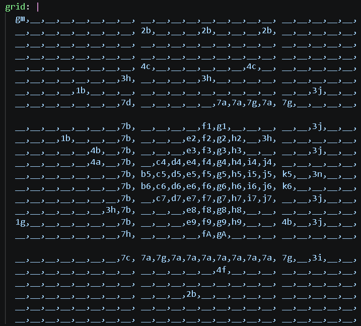

Background decorations such as trees (`3h`), lampposts (`3j`), flowers (`4a`), and pavement tiles (`7b`, `7e`, `7h`) are placed directly in the grid using their numeric prefixes. These require no corresponding gridObjects entry as they are background-layer assets.

Once a coordinate is named in the grid, it must be assigned objects in gridObjects or the engine will produce a validation error. A floor tile is the minimum valid assignment.

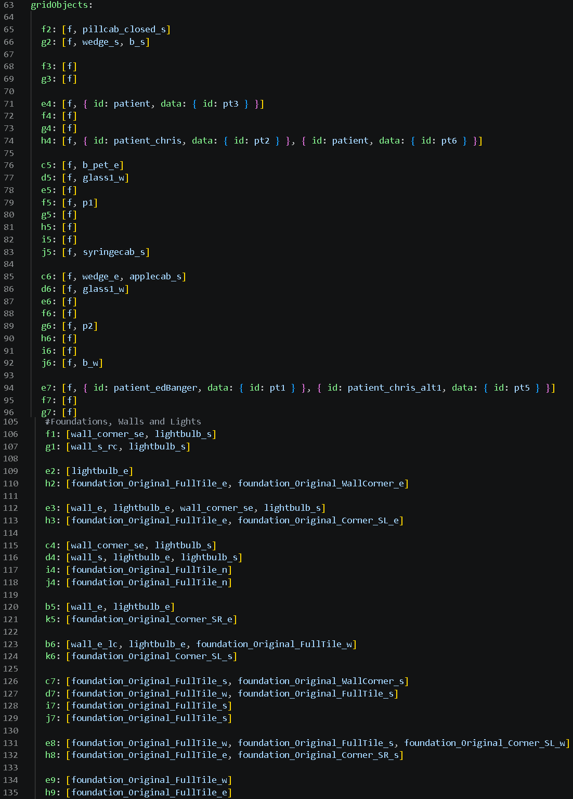

*Figure: Annotated grid showing coordinate system and object placement*

### Patient Design and globalData

The globalData section controls the behaviour of every patient in the level. Each patient is assigned a unique reference identifier (e.g. `pt1`, `pt2`) that links their grid placement to their properties. The core properties are:

- **health** — the patient's starting health value (consistently set to 8 across all levels in this project).
- **need** — the treatment type required: pill, syringe, or apple.
- **appearOnTurn** — the turn on which the patient spawns. Patients without this property are present from turn 1.
- **character** — an optional named character model (e.g. grace, sammi). Unnamed patients receive a random model.

A three-wave escalation pattern was used consistently across all six levels, distributing patients across turns 1, 3, and 6. This creates a natural difficulty curve: players begin with a manageable initial load, must treat the first wave before the second arrives, and face maximum pressure only once they have had time to establish a working strategy.

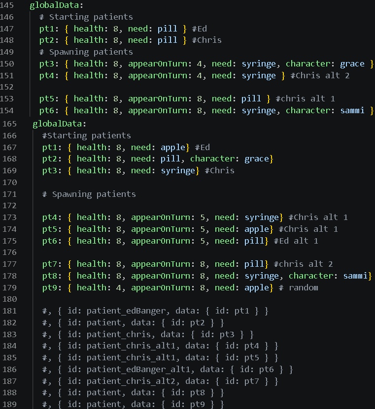

*Figure: Annotated grid showing Global Data of Level_1_players_2 and Level_8_players_4. The bottom shows the corresponding grid objects names.*

### Step-by-Step Level Design Process

Each of the six levels was constructed following a fixed eight-step process. This structured approach was developed after the initial level creation phase, where attempting to add all elements simultaneously made debugging difficult. By separating concerns into discrete steps, each stage could be tested in the game independently before the next layer of complexity was added.

The process is documented here using Level 2 (4-player variant) as the primary example, as it is the most fully featured of the six levels.

#### Step 1: Player Spawn Placement

The level begins with a minimal grid containing only a small cluster of floor tiles at the intended centre of the playspace. Player spawn points (p1–p4) are placed on these tiles, each accompanied by a `floordeco21` marker to make spawn positions visually distinct. No patients, items, or walls exist at this stage.

Starting with player positions ensures that all subsequent spatial decisions — where to place cabinets, beds, and patients — flow outward from where players begin. This prevents layouts where resources are unreachable from spawn.

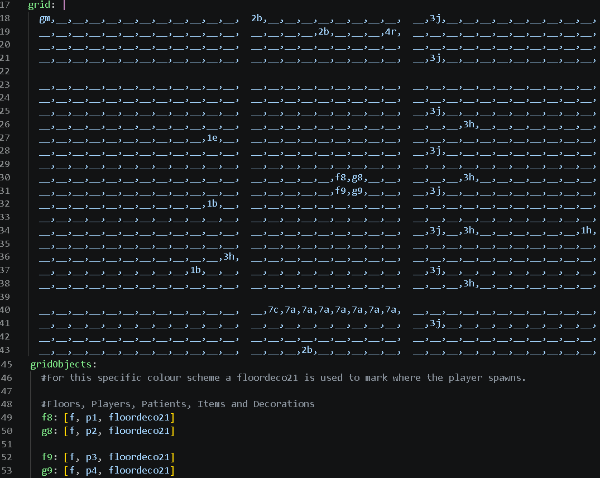

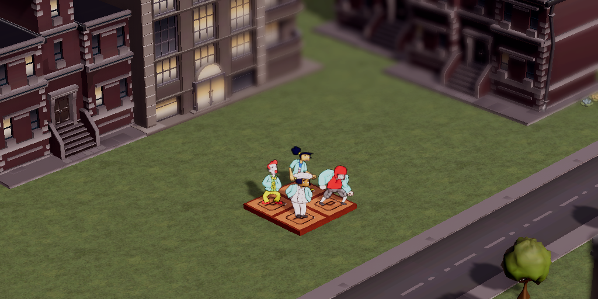

*Figure: Step 1 — Minimal grid with player spawns only*

#### Step 2: Floor Plan Layout

The grid is expanded to define the full spatial footprint of the level. Additional floor tiles are added to create distinct zones: in Level 2, this produced a northern treatment zone, a central patient area, and a southern treatment zone, with players positioned at the four cardinal extremes to encourage movement across the whole space.

No items or patients are placed at this step. The sole objective is confirming that the spatial logic works — that every zone is reachable from every spawn and that the overall layout fits within the visible camera area.

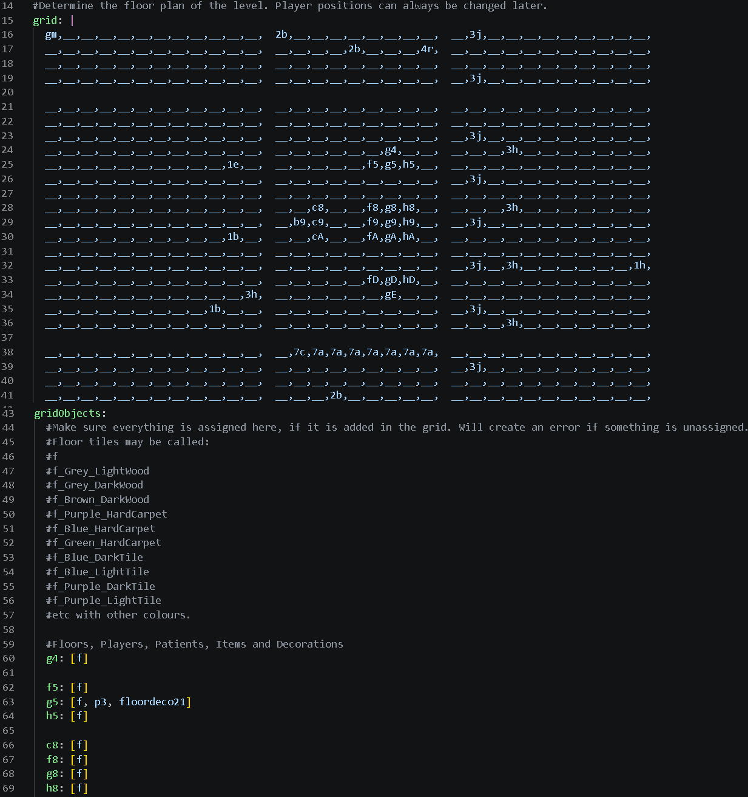

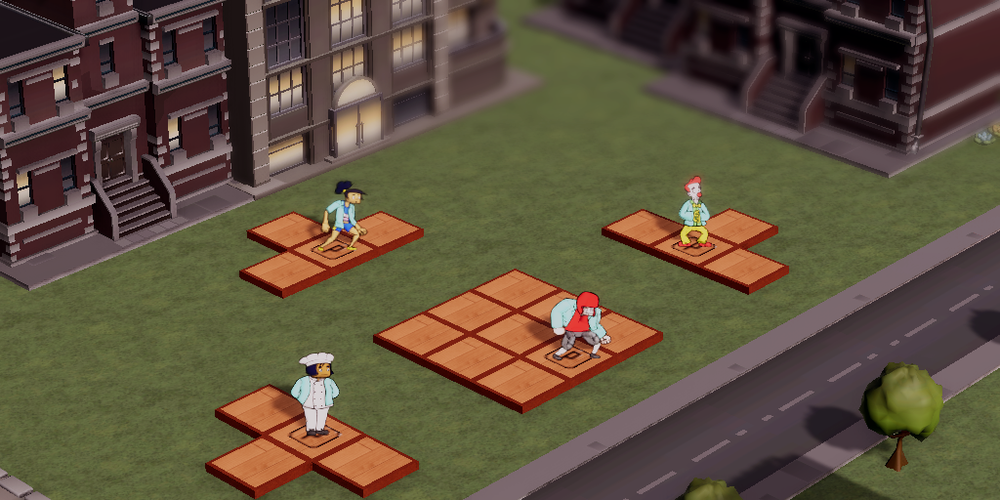

*Figure: Step 2 — Full floor plan across all zones, no items*

#### Step 3: Beds and Treatment Cabinets

The three treatment cabinet types and their associated patient beds are placed within the layout. Beds are oriented to face toward the patient area (`b_n`, `b_e`, `b_s`, `b_w`). Cabinets are positioned at the periphery of each zone, requiring players to travel to retrieve items rather than having everything within arm's reach.

Level 2 uses one cabinet of each treatment type: a syringe cabinet (`syringecab_s`) at the north end, a pill cabinet (`pillcab_closed_e`) at the west end, and an apple cabinet (`applecab_s`) at the south end. This spatial separation of treatment types is a deliberate design choice to prevent any single player from monopolising the supply.

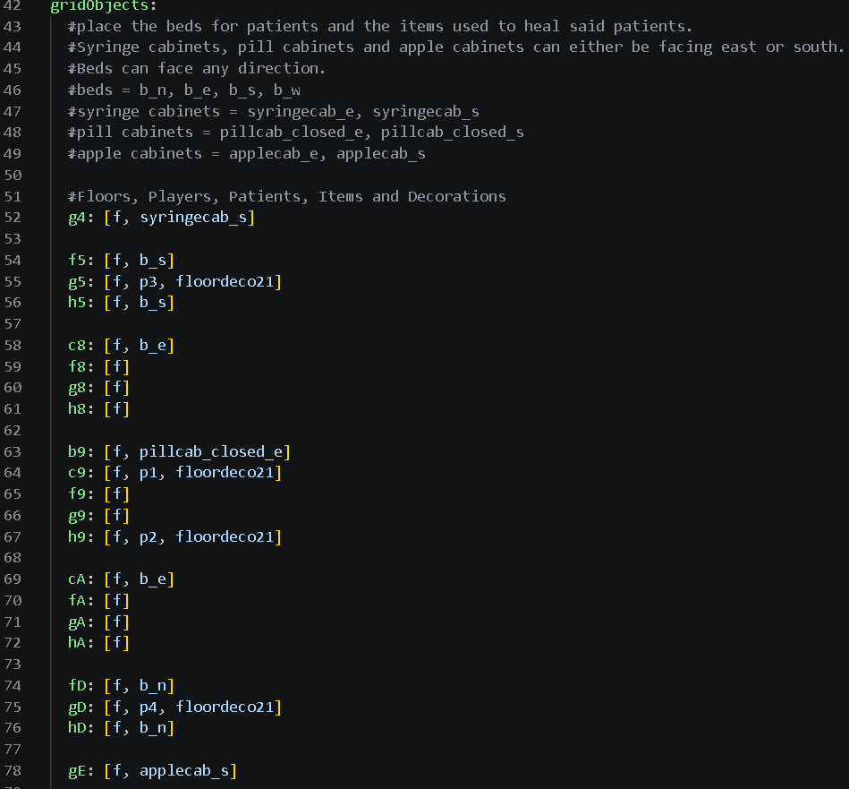

*Figure: Step 3 — Beds and all three treatment cabinets in position*

#### Step 4: Decorations

Non-functional decorative objects such as water coolers, plants, and floor stickers are added to support the clinical visual theme. These have no mechanical effect but contribute to the game's atmosphere and help players orient themselves within the space.

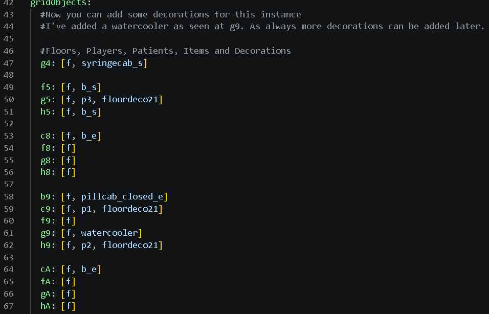

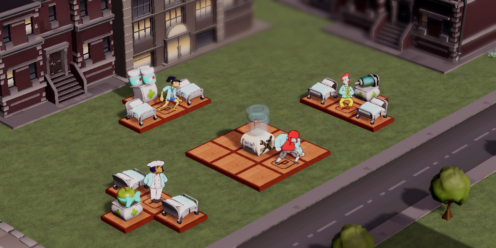

*Figure: Step 4 — Decorative items added to the level*

#### Step 5: Patient Placement and globalData

All patients are placed in the gridObjects section and their properties defined in globalData. Patients are grouped in shared tiles within the patient area and distributed across three arrival waves as described in the globalData section above. This step is the most consequential for gameplay — it determines the entire treatment challenge of the level.

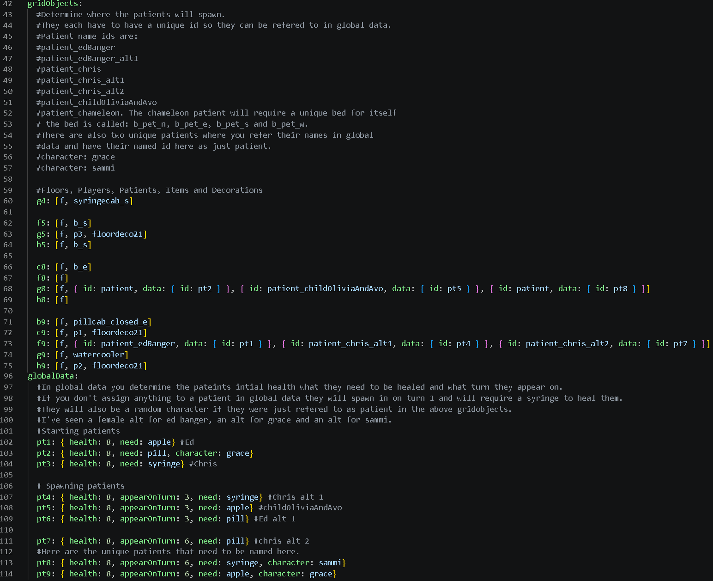

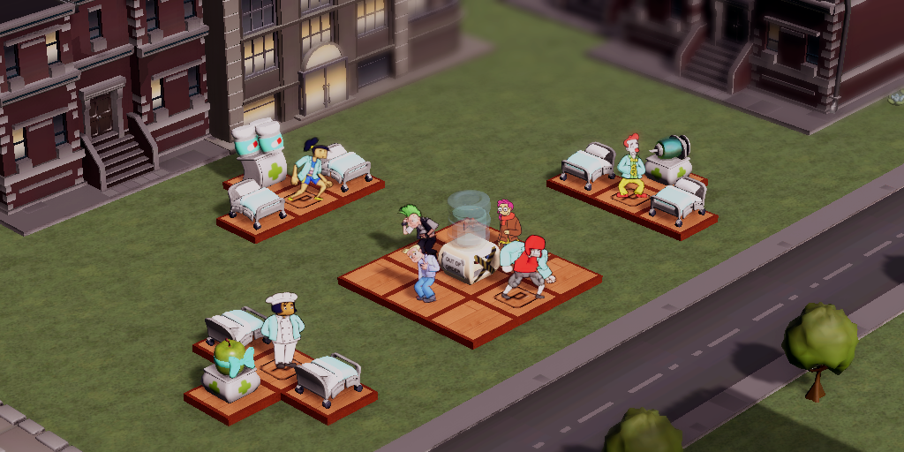

*Figure: Step 5 — All patients placed; globalData defines three-wave progression*

#### Step 6: Glass Barriers and Outer Walls

Glass barriers are introduced along zone boundaries to prevent a softlock condition: without them, players could throw patients into areas with no adjacent bed, making the level unwinnable. Two-tile-high barriers (`barrierglass2`) are used in later variants after it was found that single-height barriers could be bypassed by thrown patients.

Simultaneously, structural wall tiles are placed along the north and west boundaries. Corner variants (`wall_corner_se`, `wall_corner_IL_se`, `wall_corner_inside_se`) are used at junctions. Wedge tiles are added beneath exposed wall ends to prevent a visually floating appearance.

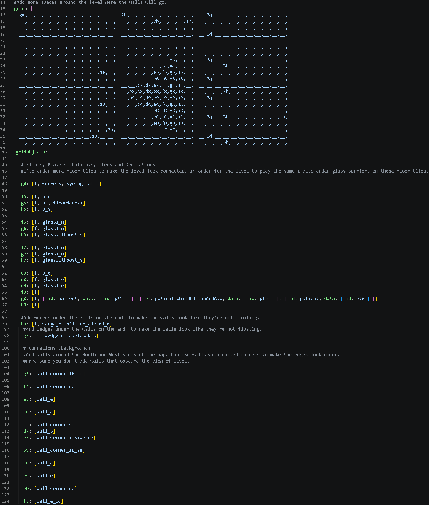

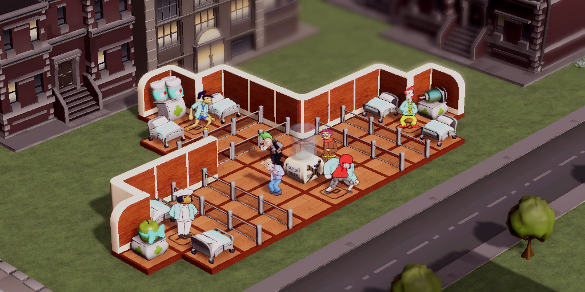

*Figure: Step 6 — Glass barriers between zones and structural walls placed*

#### Step 7: Foundation Tiles

Foundation tiles are the decorative backing panels placed behind walls and floor edges. They create a sense of architectural depth and visual solidity but have no gameplay effect. Foundation placement follows a consistent scheme: full-tile panels along east edges, corner panels at junctions, and wall-corner panels where walls meet foundations.

Only foundations visible to the player within the camera viewport are placed, avoiding unnecessary file size increase.

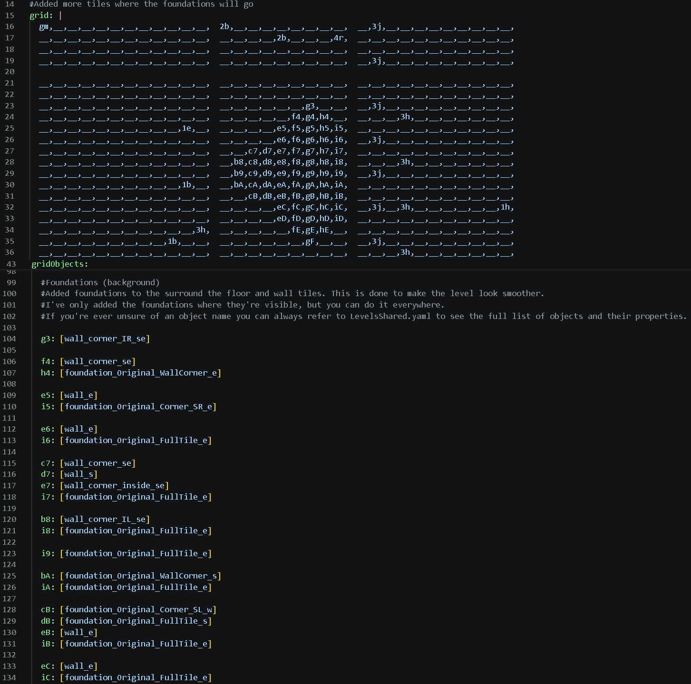

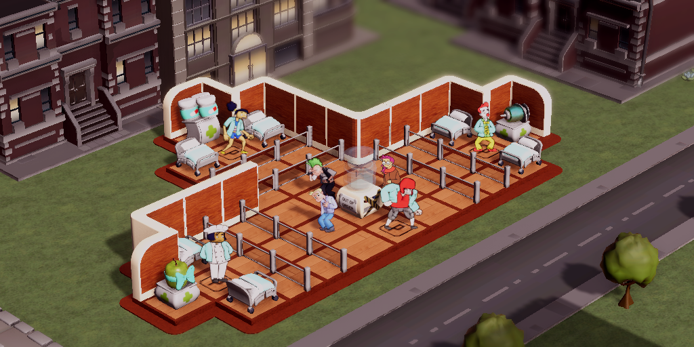

*Figure: Step 7 — Foundation tiles added behind all wall and floor edges*

#### Step 8: Background Decorations

The final step populates the empty grid cells outside the playable area with environmental background elements. These are placed directly in the grid string using their numeric codes and require no gridObjects entries. The decorations used across the six levels include trees (`3h`), lampposts (`3j`), flowers (`4a`), pavement tiles (`7b`), pavement corner tiles (`7e`), and street-lamp pavement tiles (`7h`).

This step is completed last so that it does not interfere with the spatial reasoning of earlier steps and can be adjusted freely without affecting any gameplay elements.

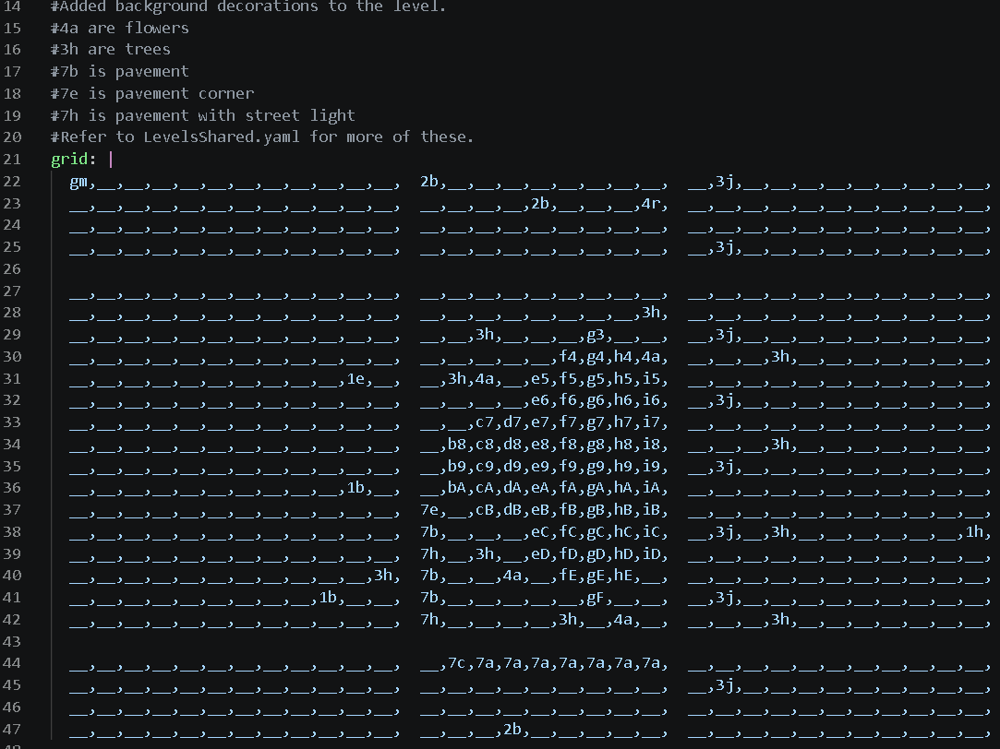

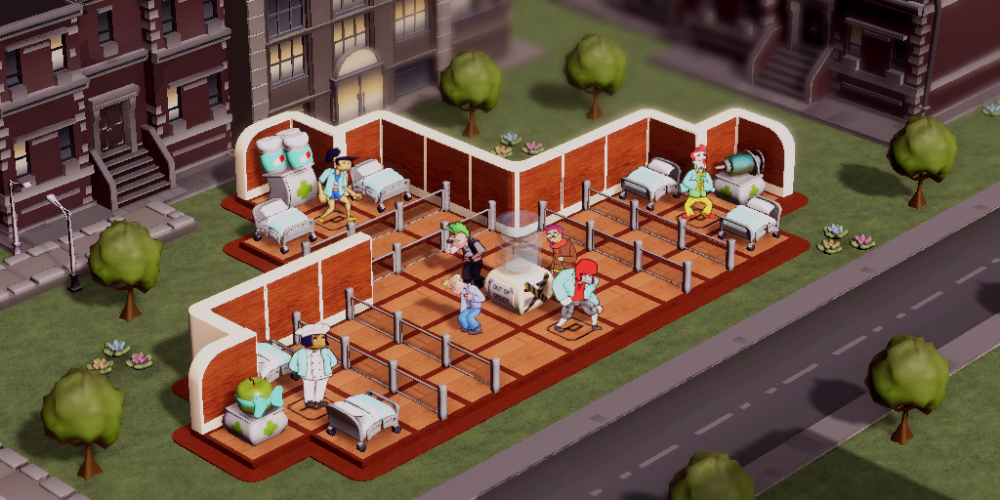

*Figure: Step 8 — Completed level with all background environmental decorations*

### Player-Count Adaptation Strategy

Every level must function correctly and remain appropriately challenging for 2-, 3-, and 4-player sessions. Rather than designing three independent levels, a top-down adaptation strategy was used: the 4-player variant is designed first to its full complexity, and the 3-player and 2-player variants are derived from it through a set of consistent reductions.

| **Design Element** | **4-Player** | **3-Player** | **2-Player** |
|---|---|---|---|
| **Players** | p1, p2, p3, p4 | p1, p2, p3 | p1, p2 |
| **Patient count** | 9 (3 per wave) | 6 (apple removed) | 6 (apple removed) |
| **Treatment types** | Syringe, Pill, Apple | Syringe, Pill | Syringe, Pill |
| **Barrier type** | Single glass | barrierglass2 (2-high) | barrierglass2 (2-high) |
| **Extra items** | Water cooler | Water cooler | Water cooler + extra syringe cabinet |
| **Spatial layout** | Full | Identical to 4-player | Identical to 4-player |

The key design insight from this process was that reducing player count does not automatically reduce difficulty proportionally. With two players managing the same patient load as three, the workload per player actually increases. To compensate, the 2-player variant of Level 2 adds an additional syringe cabinet at the centre of the patient area. This additional resource was identified through playtesting as necessary to keep the level fair rather than punishing.

Apple patients are removed in both the 3-player and 2-player variants. Managing three treatment types simultaneously with a reduced team is too demanding at this stage of the game's progression. Restricting the treatment types to syringe and pill — which share the same cabinet locations — gives smaller teams a clearer decision space.

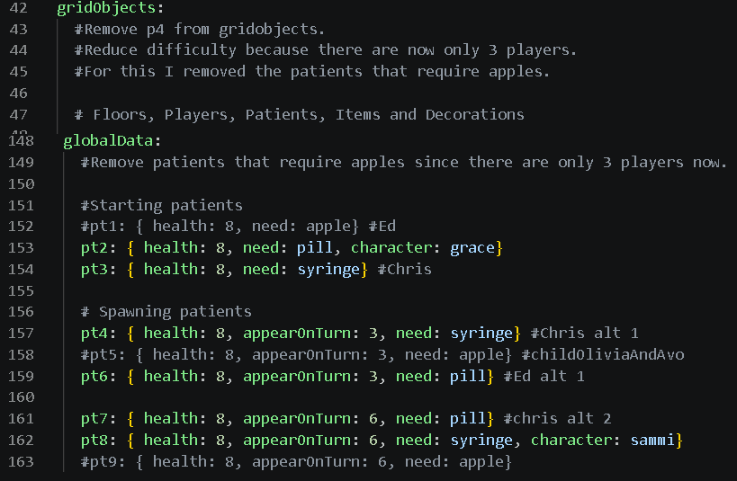

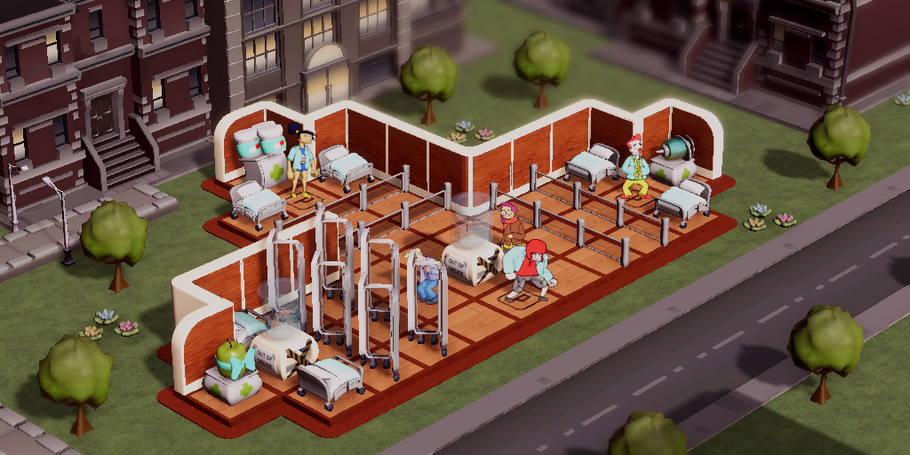

*Figure: 3-player variant — apple patients removed, p4 replaced by water cooler*

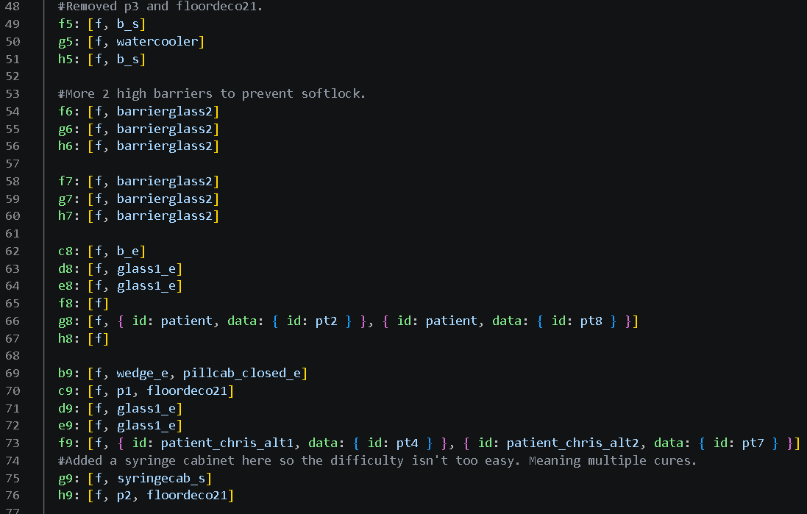

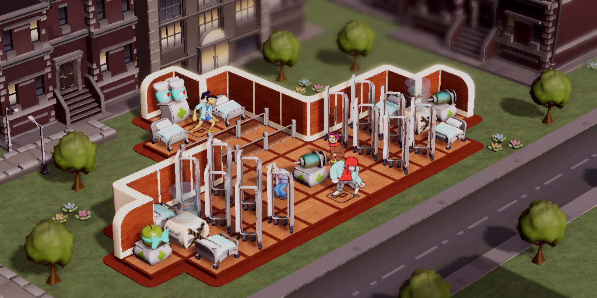

*Figure: 2-player variant — additional syringe cabinet, reduced patient spawns*

### The Six Levels

Six levels were designed and delivered for the FinalPackage collection. Each level builds on the design vocabulary established in earlier levels while introducing new spatial configurations and item arrangements. The table below provides an overview of the distinguishing features of each level.

| **Level** | **Zone Structure** | **4P Patients** | **Design Notes** |
|---|---|---|---|
| **1** | Stubby plus shape 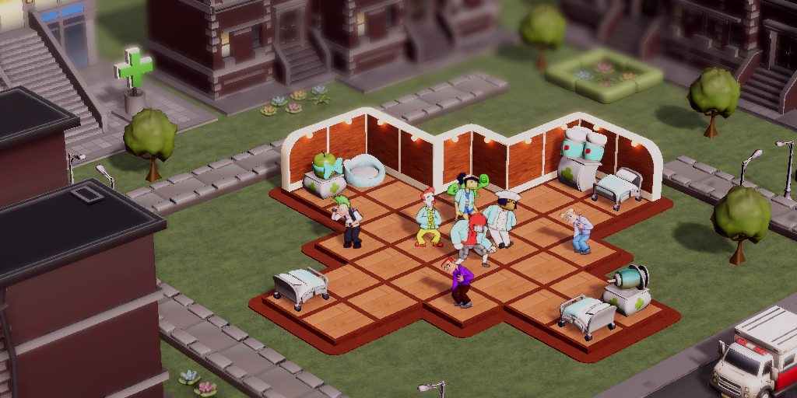| 16 | Simple layout, quite small. 3 waves of 4 patients made possible by having the cures and beds within reach during 1 turn. |
| **2** | Three-zone hub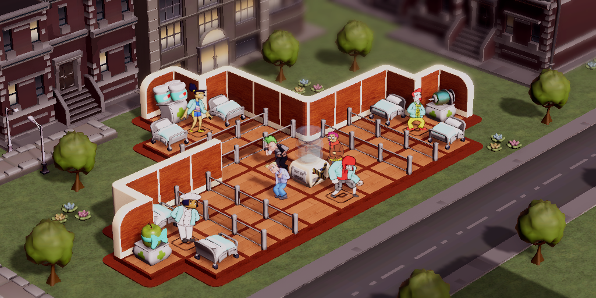 | 9 | Main hub where P1 must pick up and throw patients over glass barriers to secluded areas with other players. P1 then catches and throws required cures to each of the 3 closed areas. |
| **3** | Rectangular room divided by glass barriers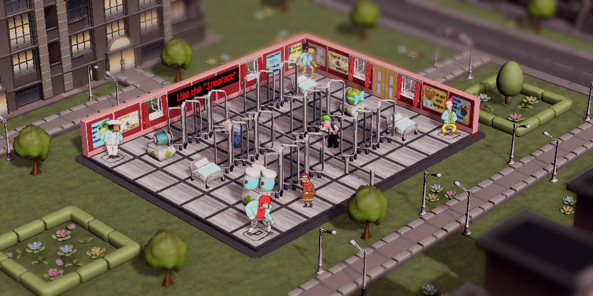 | 9 | Players must throw patients and cures down corridors to each other. |
| **4** | Snaking path (loops)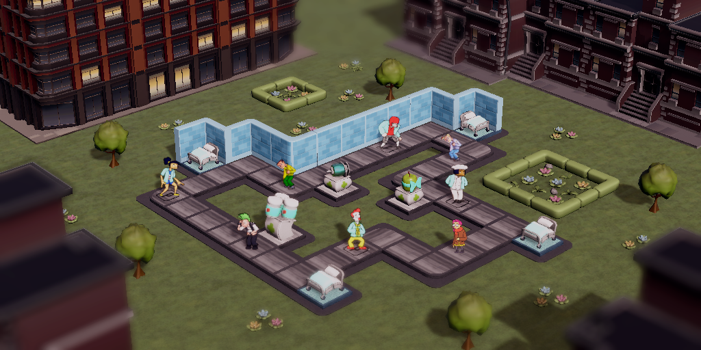 | 8 | Players must move along the path and throw things to people on the other sides. |
| **7** | Rectangular room with tall 6 sets of glass dividers positioned like the dice 6 (⠿)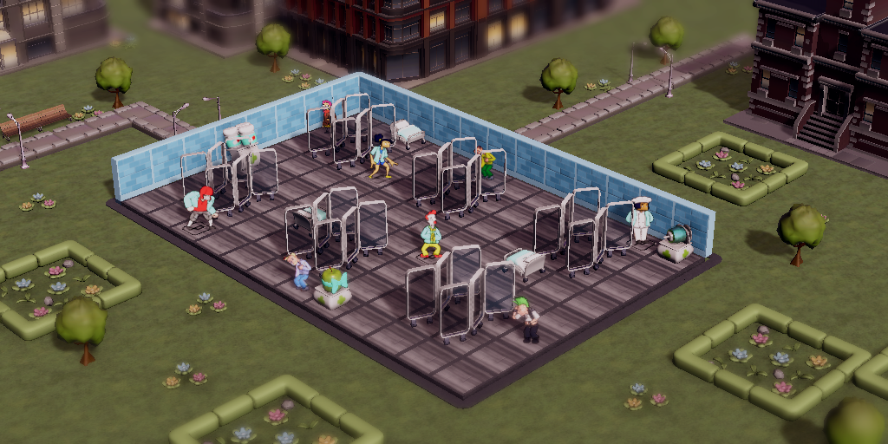 | 9 | Players can walk or throw. Free range. |
| **8** | Layout using OK initials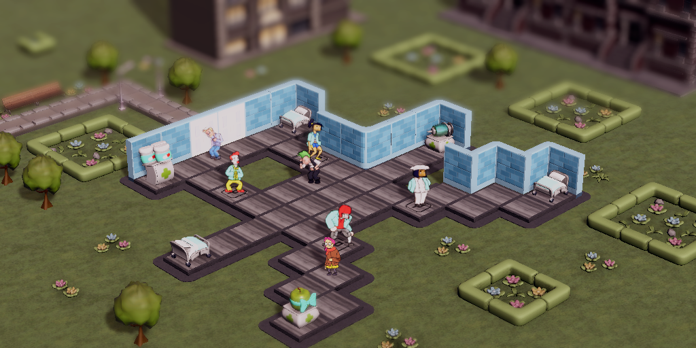 | 9 | Beds and cures are at the corners of the map, forcing players to walk long distances. |

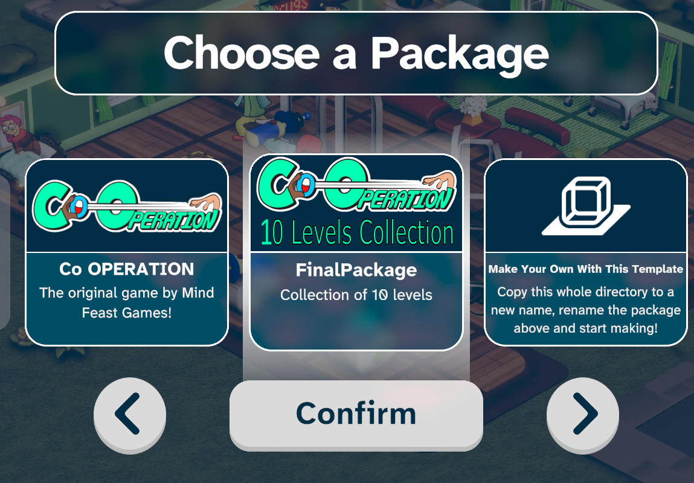

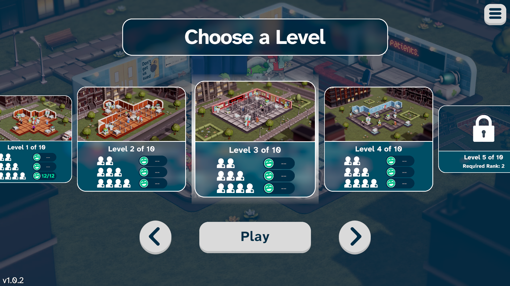

*Figure: Levels — level select carousel showing completed levels*

### Package Configuration and Unlock System

The package.yaml file registers all levels and configures the rank-based progression system. Players begin with levels 1–4 unlocked. Subsequent levels are gated behind rank thresholds earned by curing unique patients across all completed levels. This system incentivises replay of earlier levels before advancing.

| **Rank** | **Threshold** | **Levels Unlocked** | **Unlocked by Default?** |
|---|---|---|---|
| 1 (start) | N/A | 1, 2, 3, 4 | Yes |
| 2 | 11 unique cures | 5, 6 | No |
| 3 | 15 unique cures | 7, 8 | No |
| 4 | 11 unique cures | 9, 10 | No |

### Levels as Training Data for AI Generation

The original objective of the manual level design work was to produce structured, well-documented examples that could serve as training data for future AI-based level generation and to assist others in their own level creation journey. Each step file in the development process represents a distinct, valid game state, giving a hypothetical model examples of both intermediate and final level configurations.

The design follows a decomposed generation strategy in which level creation is broken into three sequential phases that an AI model could replicate independently:

- **Phase 1 — Floor plan generation:** produce a valid grid of floor tiles, walls, and spatial zones with no items or patients.
- **Phase 2 — Item placement:** given a floor plan, assign treatment cabinets, beds, barriers, and decorative items.
- **Phase 3 — Patient and player assignment:** given a populated floor plan, determine spawn positions, patient wave timing, and treatment requirements.

This decomposition mirrors the eight-step manual process and reduces the complexity of any single generation task, making it more tractable for a language model to learn from examples. The 10 levels delivered by this project, alongside the 16 levels shipped with the base game, can form the initial training data for future peers or us to develop this AI generation level capability.