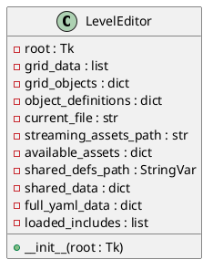

# Co-Operation: Multi-Turn — AI Level Generation Project

**Client:** Shaz Yousaf — Mind Feast Games

**Group 1**

| Group Member | Role |
|---|---|
| David Williams | Group Admin & Python Automation |
| Harrison McDevitt | AI Research & Lua |
| Oscar Kennedy | Lead Level Designer |
| Mervin Manuel | GUI Level Editor & Secondary Group Admin |

---

# Table of Contents

1. [Introduction](#introduction)
2. [Project Management](#project-management)
   - 2.1 [Team Structure & Communication](#21-team-structure--communication)
   - 2.2 [Sprint Planning & Timeline](#22-sprint-planning--timeline)
   - 2.3 [Risk Management](#23-risk-management)
3. [Design](#design)
   - 3.1 [Initial AI Level Generation Concept](#31-initial-ai-level-generation-concept)
   - 3.2 [The Agentic Approach](#32-the-agentic-approach)
   - 3.3 [The Pivot: From Generation to Authoring](#33-the-pivot-from-generation-to-authoring)
   - 3.4 [Level Editor Architecture](#34-level-editor-architecture)
   - 3.5 [Development Process with OpenCode](#35-development-process-with-opencode)
   - 3.6 [UML Diagrams](#36-uml-diagrams)
4. [Quality Assurance & Testing](#quality-assurance--testing)
   - 4.1 [Unit Tests](#41-unit-tests)
   - 4.2 [Integration & Functional Tests](#42-integration--functional-tests)
5. [Conclusion](#conclusion)
6. [References](#references)
7. [Appendix: Personal Reflections](#appendix-personal-reflections)

---

# Introduction


Co-Operation: Multi-Turn is a game created by Mind Feast Games (founded in 2020) that is centred around a turn-based gameplay loop of healing and relocating patients within a comedic hospital setting and getting them the correct medicine in a timely manner. Mind Feast Games create games as part of an initiative to encourage people to collaborate and connect with one another — something the studio achieved convincingly with this title. A standout aspect of the game is the integration of mobile devices to control the on-screen characters, implemented in a similar vein to the Jackbox series. Players queue up a set of actions that play out on a shared screen, and the ability to join a lobby from any browser-capable device — phone, laptop, tablet — makes the experience uniquely portable. Movement must be coordinated actively for the game to run smoothly, and the lively group discussion this demands regularly produces comical moments when a wrong move is chosen.


We played the game as a group to gauge its gameplay loop and understand how the levels were structured. We found a lot of heart in the design, and the level layouts complemented the core game loop well across all of the base-game content. We had fun dissecting the various traversal avenues available to the player and examining how each prop altered movement possibilities differently — for example, low barriers allow items and patients to be thrown over them, while solid walls block movement entirely. During this play session we began forming early ideas about how we might approach level generation.


The brief from our client, Mind Feast Games, asked us to create AI tools capable of generating an arbitrary number of levels that were cohesive, fun to play, and of comparable quality to the base game's existing content. The intended workflow was for levels to be generated externally and hand-picked by the developers before being included in a future release. This placed a premium on quality over quantity: generated levels needed to be architecturally sound and capable of sitting alongside professionally designed content without feeling out of place.

Understanding the level file format was the essential first step. Levels in Co-Operation: Multi-Turn are defined entirely in YAML files. A level consists of a two-dimensional grid of two-character alphanumeric tile codes, a `gridObjects` section that maps each code to an ordered list of game objects, a `cameraSettings` block, and an `include` directive that pulls in shared asset definitions from a file called `LevelsShared.yaml`. A tile such as `f` denotes a floor tile, `2b` a particular building variant, and the special code `gm` anchors the level's management and scoring systems. This structure is both expressive and precise — even a small formatting error in the YAML causes the game engine to refuse to load the level.

> **Game Format Summary:** Levels are defined as YAML files containing: an `include` directive pointing to `LevelsShared.yaml`; a `sceneName` indicating the Unity background scene; a `grid` block storing comma-separated 2-character tile codes as a literal block scalar (`|`); a `gridObjects` section mapping each code to an ordered list of objects; `cameraSettings`; and an `objectDefinitions` section for user-defined tile presets.

---

# Project Management

## 2.1 Team Structure & Communication

The team was composed of four members with complementary skillsets. **David Williams** assumed the role of Group Admin, coordinating task allocation, maintaining the shared repository, and leading the Python automation work. **Harrison McDevitt** was responsible for AI research and explored Lua scripting as a potential route for in-engine level validation. **Oscar Kennedy**, as Lead Level Designer, contributed domain expertise and designed the six hand-crafted levels that formed part of the final deliverable. **Mervin Manuel** took responsibility for the GUI Level Editor and served as Secondary Group Admin.

Communication was maintained through a shared messaging channel and regular in-person meetings during university contact hours. Version control was handled via Git, with each team member working on feature branches before merging to a shared main branch. Code reviews were conducted informally but consistently throughout Semester 2.

| Member | Primary Responsibilities |
|---|---|
| David Williams | Project coordination, Python scripting, YAML automation pipeline, documentation |
| Harrison McDevitt | AI research (LLM prompt engineering, agentic testing concept), Lua scripting, QA planning |
| Oscar Kennedy | Level design philosophy, six hand-crafted levels, playability review |
| Mervin Manuel | GUI level editor (Python/Tkinter), YAML integration, UX iteration, secondary admin |

## 2.2 Sprint Planning & Timeline

The project spanned two semesters. Semester 1 was largely exploratory — the team spent considerable time understanding the game's data format, playing existing levels, and researching generative approaches. This period was valuable for building domain knowledge but produced no concrete technical output, and it created a dependency on strategic decisions that were deferred into Semester 2.

Semester 2 was divided into informal two-week sprints. The first sprint was dedicated entirely to resolving the overarching strategic question: what would the team actually build? The subsequent sprints tracked the following milestones:

- **Sprint 1 (Weeks 1–2):** Strategic decision confirmed — pivot to GUI editor; YAML format research completed.
- **Sprint 2 (Weeks 3–4):** Core Tkinter grid editor prototype; YAML load/save working end-to-end.
- **Sprint 3 (Weeks 5–6):** Visual tile rendering via GLB texture extraction; mod folder integration.
- **Sprint 4 (Weeks 7–8):** Paint tool, camera settings editor, Ctrl+S saving, close-prompt for unsaved changes.
- **Sprint 5 (Weeks 9–10):** Undo/redo stack, quick palette dropdown, user-defined grid codes.
- **Sprint 6 (Weeks 11–12):** Final polish, comment pass through all code, README update, level hand-off to Oscar.

## 2.3 Risk Management

Several risks were identified throughout the project, some of which materialised and required active mitigation.

The most significant risk was **scope ambiguity**. The original brief called for AI level generation, but no single approach was agreed upon during Semester 1. This led to the primary challenge described in Section 3 — prolonged indecision about which generation strategy to pursue. The team mitigated this by formally deciding at the start of Semester 2 to produce a high-quality tool rather than a partially-working generative algorithm.

A secondary risk was **technical compatibility with the game's YAML dialect**. The game uses custom YAML tags such as `!SpineAnimation` and `!MeshDeformAnimation` — non-standard constructs that Python's default `yaml.safe_load` rejects with a `ConstructorError`. Mervin addressed this by writing custom tag constructors for each known type, plus a generic multi-constructor fallback for any unknown tags encountered at runtime.

A third risk was **asset integration for tile visualisation**. The editor needed to display tile textures, but the game's textures were embedded inside GLB (binary GLTF) 3D model files rather than standalone image assets. This required implementing texture extraction via the `pygltflib` library, with a fallback to coloured rectangles when extraction was not possible.

> **Key Risk Summary:** The three main risks were: (1) strategic indecision leading to project delays — mitigated by a formal scope pivot; (2) YAML parsing failures due to custom tags — mitigated by custom constructors; (3) missing tile textures — mitigated by GLB texture extraction with colour fallback.

---

# Design

## 3.1 Initial AI Level Generation Concept

The project's original intention was fully automated level generation. Early team discussions centred on procedural content generation (PCG) techniques that could produce valid YAML level files without human authorship. Three broad approaches were explored during Semester 1.

### Constraint-Based Generation

The first approach involved using a constraint solver or search algorithm to explore the space of valid level configurations. Given the game's grid format and the set of known tile codes, such a system could theoretically enumerate layouts satisfying a set of design rules — minimum floor coverage, at least one patient and one medicine cabinet, a reachable path between all key objects. The fundamental challenge was defining what "valid" meant beyond technical well-formedness. A grid that loads without errors is not the same as a grid that constitutes a fun, balanced level. Encoding playability as constraints proved more complex than initially anticipated.

### Example-Based Generation

The second approach used the existing base-game levels as a training corpus. A generative model could learn patterns of tile placement and produce novel arrangements that preserved those statistical regularities — analogous to texture synthesis or Markov-chain map generation. A prototype was briefly sketched using bigram tile transition probabilities. However, the base game contained too few levels for meaningful pattern extraction, and the resulting outputs lacked the intentionality of hand-crafted design.

### LLM-Driven Generation

The third and most ambitious approach drew on large language models. Harrison investigated whether a language model — provided with the game's YAML format documentation and example levels — could generate new levels as structured text outputs. Initial experiments were promising in that the model understood the format and produced syntactically valid YAML. However, semantic coherence was inconsistent: the model would sometimes place patient spawn points without corresponding medicine cabinets, define grid codes in the `grid` block that had no entry in `gridObjects`, or produce layouts with unreachable areas. Validating and correcting this output would itself require detailed game-engine knowledge that the team did not have access to at runtime.

> **LLM Generation Challenges:** When prompted to generate level YAML, language models produced structurally valid output but frequently introduced semantic errors — missing `objectDefinitions` entries for referenced codes, incorrect `include` directive syntax, and layout configurations that produced unreachable game areas. Correcting these errors required game-engine knowledge that could not be automated without a runtime validator.

## 3.2 The Agentic Approach

One of the most intellectually stimulating avenues explored by the team was an agentic AI approach to level testing and validation. The concept, developed by Harrison, was inspired by emerging work in AI game testing: rather than having a human play a generated level to check for problems, an AI agent could be given a description of the game's rules and tasked with playing the level autonomously, logging any issues it encountered.

The envisioned architecture was a feedback loop: an LLM-based agent would receive the current level's YAML, a description of the game mechanics, and access to a set of "test actions" it could perform — checking whether every patient had a corresponding medicine cabinet, whether all floor tiles were reachable from the spawn point, whether the game management objects were correctly placed at the `gm` tile. The agent would produce a structured bug report, which could either be fed back to a generative model for correction or surfaced to a human level designer for review.

This approach was appealing because it separated the concerns of generation and validation. A generative model need not produce perfect output on the first pass; instead, it could produce a rough layout that an agentic tester would critique, and the cycle would iterate toward a playable level over successive rounds.

However, the approach encountered a fundamental practical obstacle. **The game engine is a closed Unity binary — there was no exposed API through which an agent could programmatically query the game state or run a level headlessly.** The team had no access to the game's source code and could not instrument it for automated testing. Without the ability to run levels in a controllable environment, the agentic tester was reduced to static analysis of the YAML file — useful, but a significant reduction from the full runtime validation the concept had promised.

Static YAML analysis was implemented in a limited form as part of David's Python automation scripts. These scripts checked for: orphaned GridObject references (codes that appeared in `grid` but had no corresponding `gridObjects` entry), missing `objectDefinitions` entries, and invalid grid dimensions. These checks caught common structural errors but could not detect emergent gameplay problems such as level imbalance, inaccessible areas, or unfair patient-to-medicine distances, which only manifest at runtime.

## 3.3 The Pivot: From Generation to Authoring

By the midpoint of Semester 2 it became clear that fully automated AI level generation was not achievable within the remaining timeframe. Each of the three generative approaches had fundamental blockers that could not be resolved quickly, and the agentic testing concept — while architecturally sound — was stymied by the game engine's opacity.

This realisation prompted a period of honest reflection. The team had invested considerable time in research and had little shipped tooling to show for it. The risk of submitting a partially-working generative algorithm — one that produced technically valid YAML but levels of questionable quality — was weighed against pivoting to a different deliverable entirely.

The pivot decision was made collectively. Rather than abandoning the project's AI dimension, the team reframed the problem: **a high-quality GUI level editor, designed with deep awareness of the game's format, would become the primary deliverable.** This reframing served two purposes simultaneously. First, the editor would directly accelerate human-authored level creation, allowing the client's team to produce expansion content without manual YAML editing. Second, the levels created with it — along with the editor's documented format rules — would constitute a structured training corpus for a future AI pipeline. The `skills.md` file produced alongside the editor was explicitly designed with this future use case in mind.

This pivot was informed by pragmatic constraints, but it also carried genuine value. The resulting editor is a sophisticated tool that non-technical designers can use productively, and it delivers on the core promise of the brief — making it faster and easier to create more levels for Co-Operation: Multi-Turn.

> **Pivot Rationale:** The pivot was driven by three factors: (1) insufficient training data for example-based models; (2) lack of runtime API access for agentic testing; (3) LLM output requiring domain-expert validation that was itself more expensive than manual design. The editor reframes AI-assistance as future-compatible infrastructure rather than an immediate deliverable.

## 3.4 Level Editor Architecture

The level editor, `level_editor.py`, is a single-file Python application built on the Tkinter GUI framework. It follows an RPG Maker-inspired dual-panel design — separating tile grid editing (the map layer) from GridObject editing (the event/object layer). This mirrors the conceptual distinction the game engine itself draws between the `grid` (which defines spatial layout) and the `gridObjects` section (which attaches behaviour and entities to each cell).

### Core Data Model

The application maintains two primary data structures: a two-dimensional list (`grid_data`) storing the two-character code occupying each cell, and a dictionary (`grid_objects`) mapping each code to its ordered list of GridObject definitions. These are kept in sync throughout the session and serialised to YAML on save.

### YAML Handling

One of the editor's most technically demanding components is its YAML subsystem. The game uses a superset of YAML that includes custom tags such as `!SpineAnimation`, `!GLBAnimation`, `!TweenAnimation`, and `!MeshDeformAnimation`. Python's PyYAML library rejects these by default with a `ConstructorError`. The editor addresses this with a suite of custom constructors registered at module load time:

```python
class TaggedObject(dict):
    """Dict subclass that remembers its YAML tag for round-trip serialisation."""
    def __init__(self, *args, **kwargs):
        tag = kwargs.pop('_tag', None)
        super().__init__(*args, **kwargs)
        self._tag = tag

def tagged_object_representer(dumper, data):
    tag = getattr(data, '_tag', None)
    if tag:
        return dumper.represent_mapping(f'!{tag}', dict(data))
    return dumper.represent_mapping('tag:yaml.org,2002:map', dict(data))

yaml.add_representer(TaggedObject, tagged_object_representer)
```

A `TaggedObject` is a dictionary subclass that remembers the YAML tag that produced it, allowing complete round-trip serialisation without data loss. Alongside the named constructors, a generic multi-constructor handles any unknown custom tag the editor encounters in the wild:

```python
def generic_tag_handler(loader, suffix, node):
    if isinstance(node, yaml.MappingNode):
        data = loader.construct_mapping(node)
        return TaggedObject(data, _tag=suffix)
    elif isinstance(node, yaml.SequenceNode):
        data = loader.construct_sequence(node)
        return TaggedObject({'_data': data, '_tag': suffix})
    else:
        data = loader.construct_scalar(node)
        return TaggedObject({'_value': data, '_tag': suffix})

yaml.add_multi_constructor('!', generic_tag_handler, Loader=yaml.SafeLoader)
```

The editor also implements full **YAML include resolution**. When a level file contains an `include` directive (typically pointing to `LevelsShared.yaml`), the editor recursively loads the referenced file and merges its contents into the working data model. Circular includes are detected via a set of already-visited absolute paths and reported as warnings. The original include list is preserved in the serialised output so saved files retain the correct `include` directive rather than inlining all shared definitions.

### Visual Tile Rendering

The game's tile assets are stored as 3D GLB models rather than 2D sprites, which created an unexpected challenge. The editor's first rendering strategy attempted to locate PNG files in the game's `art/2d` folder, matching filenames to the tile codes defined in `LevelsShared.yaml`. This worked for a subset of tiles but failed for the majority, which had no standalone 2D asset.

The fallback strategy uses the `pygltflib` library to open each tile's GLB file and extract its albedo texture. GLB files can contain multiple material textures; the editor specifically targets the albedo (base colour) map rather than normal or specular maps. Extracted textures are cached as PIL `Image` objects and resized to cell dimensions for display. When no texture can be extracted, cells fall back to a distinctive coloured rectangle derived from the tile code's hash.

### User Interaction Features

The editor's feature set was informed directly by a detailed development conversation with the client, iterating through OpenCode. Key features include:

- **RPG Maker-style paint tool:** right-click and drag to paint the current tile code across multiple cells.
- **Ctrl+Right-click eraser:** clears painted cells without changing the current selection.
- **Scroll-wheel zoom:** smoothly scales the grid view between configurable minimum and maximum zoom levels.
- **Middle-click pan:** repositions the viewport over large grids without the scrollbars.
- **Undo/Redo (Ctrl+Z / Ctrl+Shift+Z):** a capped history stack of 50 grid states enables non-destructive experimentation.
- **Quick palette:** a dropdown populated from both the game's shared definitions and user-defined grid codes.
- **Camera settings editor:** a pop-up dialog for all `cameraSettings` fields with per-field reset-to-default buttons.
- **Ctrl+S save:** serialises the current level to YAML with a close-prompt safeguard for unsaved changes.

## 3.5 Development Process with OpenCode

The level editor was developed using OpenCode, an AI-assisted coding tool, in a conversational and iterative fashion. The development conversation — preserved in the project's documentation — reveals a pattern characteristic of this kind of AI-assisted development: the developer poses a high-level requirement, the AI produces an implementation, the developer tests it, identifies problems, and feeds those problems back as subsequent prompts.

The initial request was deliberately broad: *given documentation of the YAML format and an example level file, build a Python Tkinter editor focused on grid editing with separate GridObject creation, similar to RPG Maker.* The AI produced a functional prototype in a single response, but iteration was required immediately: the YAML include system was broken, the mod folder structure was not correctly inferred, and there was no visual tile rendering.

Each of these issues became its own conversation thread. The include directive support was addressed first, then folder inference, then texture rendering. Texture rendering required three successive refinements before working correctly: the initial implementation attempted to load PNG files directly, then switched to GLB extraction but loaded normal maps instead of albedo maps, and finally correctly targeted albedo textures after the developer inspected the temp folder and reported the symptom.

This process demonstrated both the power and the practical limits of AI-assisted coding. The AI produced large, structurally sound code blocks rapidly, but it required precise, symptom-level feedback to converge on correct behaviour. Features like undo/redo, the paint tool, and the quick palette were added incrementally without breaking existing functionality, reflecting the quality of the underlying architecture the AI had established.

A particularly instructive episode concerned reducing YAML output file size. Early versions of the editor copied the entire contents of `LevelsShared.yaml` into each saved level file. This produced multi-thousand-line documents that failed to load in the game engine with the error:

```
Value for parameter 'objectDefinitions' not found in deserialized data
for type 'cooperation.model.levels.CoOperationLevelDefinition'
```

The fix required understanding the game engine's precise expectations: `objectDefinitions: {}` must be present even when empty, and the level file must contain an `include: [LevelsShared.yaml]` directive rather than inlining the shared content. Restructuring the save logic to emit only the minimal required keys resolved the issue.

## 3.6 UML Diagrams

### Class Overview

The editor's architecture is organised around three primary responsibilities: data management, rendering, and user interaction. The five main classes are described below.

**`LevelEditorApp`** is the root class, inheriting from `tk.Tk`. It owns the central data structures: `grid_data` (2D list of tile codes), `grid_objects` (dict mapping codes to GridObject lists), `object_definitions` (dict of user-defined tile presets), and the undo/redo stacks. It manages the overall layout — menu bar, scrollable canvas grid panel, side palette panel — and dispatches all keyboard shortcuts.



```python
class LevelEditor:
    """Main Level Editor application"""
    def __init__(self, root):
        self.root = root
        self.root.title("Co OPERATION: MultiTurn - Level Editor")
        self.root.geometry("1300x850")
        
        # Data
        self.grid_data = []  # 2D list of cell codes
        self.grid_objects = {}  # code -> list of objects
        self.object_definitions = {}  # code -> definition
        self.current_file = None
        self.streaming_assets_path = None
        self.available_assets = {'3d': [], '2d': [], 'sounds': []}
        
        # Shared definitions file path
        self.shared_defs_path = tk.StringVar()  # Path to shared YAML file
        self.shared_data = {}  # Cached shared definitions data
        
        # Full YAML data preservation
        self.full_yaml_data = {}  # Store full YAML to preserve all sections
        self.loaded_includes = []  # Track loaded include files
        
        # Grid state
        self.grid_rows = 15
        self.grid_cols = 12
        self.cell_size = 42
        self.selected_cell = None
        
        # Image display support
        self.cell_images = {}  # (row, col) -> canvas image id
        self.image_cache = {}  # (filepath, size) -> PhotoImage
        self._image_refs = []  # Prevent garbage collection
        self.extracted_textures = {}  # glb_path -> extracted_png_path
        
        # Pan state for middle-click panning
        self.pan_start = None  # (x, y) canvas coordinates
        
        # Selection highlight
        self.selection_id = None  # Canvas item id for selection rectangle
        
        # Painting state (RPG Maker-style)
        self.paint_code = None  # Last applied grid code for painting
        self.painting = False  # Whether right-click painting is active
        self.erasing = False  # Whether Ctrl+Right-click eraser mode is active
        
        # Undo/Redo system
        self.undo_stack = []  # History of previous states
        self.redo_stack = []  # States that were undone
        self.max_undo_history = 50  # Maximum undo history size
        
        # Camera settings (from YAML cameraSettings)
        self.camera_settings = {}  # Stores cameraSettings dict
        
        # Setup UI
        self.setup_menu()
        self.setup_ui()
        self.setup_grid()
        
        # Initialize with empty grid
        self.init_empty_grid()
        
        # Auto-detect Mod folder (contains Art/ and Levels/)
        self.root.after(100, self.auto_detect_mod_folder)
        
        # Bind Ctrl+S to save
        self.root.bind('<Control-s>', lambda e: self.save_yaml())
        self.root.bind('<Control-S>', lambda e: self.save_yaml())
        
        # Bind Ctrl+Z (Undo) and Ctrl+Shift+Z (Redo)
        self.root.bind_all('<Control-z>', self.undo)
        self.root.bind_all('<Control-Shift-Z>', self.redo)
        
        # Prompt on close
        self.root.protocol("WM_DELETE_WINDOW", self.on_closing)
```

**`GridObjectDialog`** is a modal `tk.Toplevel` presenting a scrollable listbox of the GridObjects assigned to a selected cell. It supports adding string-reference objects, adding inline dictionary definitions via YAML parsing, editing existing entries, reordering via up/down buttons, and removing entries.

```python
class GridObjectDialog:
    """Dialog for editing GridObjects for a single cell (like RPG Maker event editor)"""
    def __init__(self, parent, cell_code, grid_objects, object_definitions, game_assets_path=None):
        self.parent = parent
        self.cell_code = cell_code
        self.grid_objects = grid_objects
        self.object_definitions = object_definitions
        self.game_assets_path = game_assets_path
        self.result = None
        
        self.dialog = tk.Toplevel(parent)
        self.dialog.title(f"GridObjects Editor - Cell {cell_code}")
        self.dialog.geometry("650x550")
        self.dialog.transient(parent)
        self.dialog.grab_set()
        
        self.setup_ui()
        self.load_current_objects()
```

**`GameFolderBrowser`** encapsulates the logic for locating and validating the mod folder. It offers auto-detection across common Steam installation paths and a manual browse fallback. Once the folder is set, it resolves the locations of `LevelsShared.yaml` and the `art/3d` subfolder used for GLB texture extraction.

```python
class GameFolderBrowser:
    """Handles browsing and integrating with the game's folder structure"""
    def __init__(self, parent, editor):
        self.parent = parent
        self.editor = editor
        self.game_path = tk.StringVar()
        
    def find_game_path(self):
        """Try to auto-find the game installation path"""
        possible_paths = [
            r"C:\Program Files (x86)\Steam\steamapps\common\Co OPERATION MultiTurn",
            r"C:\Program Files\Steam\steamapps\common\Co OPERATION MultiTurn",
            os.path.expanduser(r"~\Games\Co OPERATION MultiTurn"),
        ]
        
        for path in possible_paths:
            if os.path.exists(path):
                self.game_path.set(path)
                return path
                
        return None
        
    def browse_for_game(self):
        """Open dialog to browse for game folder"""
        initial = self.game_path.get() or "C:\\"
        path = filedialog.askdirectory(
            title="Select Co OPERATION: MultiTurn Game Folder",
            initialdir=initial
        )
        if path:
            self.game_path.set(path)
            self.load_game_structure(path)
            return path
        return None
        
    def load_game_structure(self, game_path):
        """Load the game's folder structure"""
        # Try to find StreamingAssets
        possible_assets = [
            os.path.join(game_path, "Co OPERATION MultiTurn_Data", "StreamingAssets"),
            os.path.join(game_path, "StreamingAssets"),
            os.path.join(game_path, "Data", "StreamingAssets"),
        ]
        
        streaming_assets = None
        for path in possible_assets:
            if os.path.exists(path):
                streaming_assets = path
                break
                
        if streaming_assets:
            self.editor.streaming_assets_path = streaming_assets
            self.editor.load_assets_from_folder(streaming_assets)
            return True
        else:
            messagebox.showwarning("Folder Not Found", 
                f"Could not find StreamingAssets in:\n{game_path}\n\n"
                "Please ensure you selected the correct game folder.")
            return False
```

**`CameraSettingsDialog`** is a pop-up form covering all `cameraSettings` fields. It reads current values from the working data model and writes them back on confirmation, with per-field reset-to-default buttons.

```python
self.edit_menu.add_command(label="Camera Settings...", command=self.edit_camera_settings)
```

```python
def edit_camera_settings(self):
        """Open dialog to edit cameraSettings (type, staticSettings, position, target)"""
        dialog = tk.Toplevel(self.root)
        dialog.title("Camera Settings")
        dialog.geometry("400x550")
        dialog.transient(self.root)
        dialog.grab_set()
        
        main = ttk.Frame(dialog, padding="10")
        main.pack(fill=tk.BOTH, expand=True)
        
        # Get current settings or use defaults
        settings = self.camera_settings if self.camera_settings else {}
        cam_type = settings.get('type', 'Static')
        static = settings.get('staticSettings', {})
        pos = settings.get('position', {})
        target = settings.get('target', {})
        
        # Type selector
        ttk.Label(main, text="Camera Type:").grid(row=0, column=0, sticky=tk.W, pady=(0, 5))
        type_var = tk.StringVar(value=cam_type)
        type_combo = ttk.Combobox(main, textvariable=type_var, state="readonly", width=15)
        type_combo['values'] = ['Static', 'Dynamic']
        type_combo.grid(row=0, column=1, sticky=tk.W, pady=(0, 5))
        
        # Static Settings frame
        static_frame = ttk.LabelFrame(main, text="Static Settings", padding="5")
        static_frame.grid(row=1, column=0, columnspan=2, sticky=(tk.W, tk.E), pady=5)
        
        ttk.Label(static_frame, text="distanceMultiplier:").grid(row=0, column=0, sticky=tk.W, pady=2)
        dist_var = tk.DoubleVar(value=static.get('distanceMultiplier', 2.0))
        ttk.Entry(static_frame, textvariable=dist_var, width=10).grid(row=0, column=1, pady=2)
        
        ttk.Label(static_frame, text="heightMultiplier:").grid(row=1, column=0, sticky=tk.W, pady=2)
        height_var = tk.DoubleVar(value=static.get('heightMultiplier', 0.73))
        ttk.Entry(static_frame, textvariable=height_var, width=10).grid(row=1, column=1, pady=2)
        
        ttk.Label(static_frame, text="FOV:").grid(row=2, column=0, sticky=tk.W, pady=2)
        fov_var = tk.DoubleVar(value=static.get('FOV', 15))
        ttk.Entry(static_frame, textvariable=fov_var, width=10).grid(row=2, column=1, pady=2)
        
        ttk.Label(static_frame, text="editorCameraSizeMultiplier:").grid(row=3, column=0, sticky=tk.W, pady=2)
        size_var = tk.DoubleVar(value=static.get('editorCameraSizeMultiplier', 0.55))
        ttk.Entry(static_frame, textvariable=size_var, width=10).grid(row=3, column=1, pady=2)
        
        ttk.Label(static_frame, text="editorCameraHeightMultiplier:").grid(row=4, column=0, sticky=tk.W, pady=2)
        cam_height_var = tk.DoubleVar(value=static.get('editorCameraHeightMultiplier', 1.02))
        ttk.Entry(static_frame, textvariable=cam_height_var, width=10).grid(row=4, column=1, pady=2)
```

**`UndoStack`** is a utility class wrapping two Python lists: the undo stack and the redo stack. It provides `push`, `undo`, and `redo` methods, with the stack capped at 50 states to prevent unbounded memory growth.

```python
    def _get_current_state(self):
        """Capture current editor state for undo/redo.
        
        Returns a deep copy of:
        - grid_data: 2D list of cell codes
        - grid_objects: dict mapping codes to object lists
        - object_definitions: dict mapping codes to definitions
        
        Uses deepcopy to ensure complete isolation between states.
        """
        return {
            'grid_data': copy.deepcopy(self.grid_data),
            'grid_objects': copy.deepcopy(self.grid_objects),
            'object_definitions': copy.deepcopy(self.object_definitions)
        }
    
    def _push_undo_state(self):
        """Save current state to undo stack before making changes.
        
        Called before any action that modifies level data.
        Clears redo stack since new actions invalidate redo history.
        Trims history to max_undo_history (removes oldest entry).
        """
        state = self._get_current_state()
        self.undo_stack.append(state)
        # Trim history if over limit (remove oldest entry)
        if len(self.undo_stack) > self.max_undo_history:
            self.undo_stack.pop(0)
        # Clear redo stack - new actions invalidate redo
        self.redo_stack.clear()
        self.update_undo_redo_menu()
    
    def _restore_state(self, state):
        """Restore editor to a previously saved state.
        
        Restores grid_data, grid_objects, and object_definitions
        from the saved state dictionary, then refreshes all UI elements.
        """
        self.grid_data = state['grid_data']
        self.grid_objects = state['grid_objects']
        self.object_definitions = state['object_definitions']
        # Refresh all UI elements to reflect restored state
        self.update_grid_display()
        if self.selected_cell:
            row, col = self.selected_cell
            self.update_cell_info(row, col)
        self.update_defs_display()
        self.update_palette_values()
    
    def undo(self, event=None):
        """Undo the last action (Ctrl+Z or Edit > Undo).
        
        Pops the last state from undo_stack and restores it.
        The current state is saved to redo_stack for possible redo.
        Shows "Nothing to undo" if undo_stack is empty.
        """
        if not self.undo_stack:
            self.status_bar.config(text="Nothing to undo")
            return
        
        # Save current state to redo stack
        current_state = self._get_current_state()
        self.redo_stack.append(current_state)
        
        # Restore previous state
        previous_state = self.undo_stack.pop()
        self._restore_state(previous_state)
        
        self.status_bar.config(text="Undo successful")
        self.update_undo_redo_menu()
```

### State Transition Model

The editor operates in three interaction modes:

| Mode | Trigger | Behaviour |
|---|---|---|
| **Normal** | Default / mouse button released | Single-click selects cell; double-click opens GridObjectDialog |
| **Paint** | Right mouse button held | Each cell the cursor enters is updated to the current paint code |
| **Erase** | Ctrl + Right mouse button held | Each cell the cursor enters is cleared to `__` |

Transitions between modes are triggered by mouse button press and release events. In all modes, Ctrl+Z invokes undo and Ctrl+Shift+Z invokes redo.

> **Design Pattern Note:** The separation of the grid code (a spatial index) from the GridObjects (the behavioural data associated with that index) mirrors the Entity-Component pattern common in game engines. Each two-character code functions as a key into a shared object definitions table, allowing multiple cells to reference the same logical object type without duplicating its configuration.

### David's Python Automation Scripts

Alongside the GUI editor, David produced a set of Python automation scripts for batch processing and validation of level files. The scripts operate directly on YAML files and are intended for pipeline use rather than interactive editing.

The primary script performs structural validation: it loads a level YAML, resolves includes, and checks for orphaned grid codes (codes appearing in the `grid` block with no corresponding `gridObjects` entry), codes referenced in `gridObjects` that have no `objectDefinitions` entry, and grid dimensions that do not match the declared size. Errors are printed with line-level context to aid manual correction.

A secondary script handles batch export: given a directory of level files, it resolves all includes and produces standalone YAML files suitable for distribution without a separate `LevelsShared.yaml` dependency. This was used to prepare the six hand-crafted levels for handoff to the client.

```python
# Example: validate a single level file
def validate_level(filepath):
    data, warnings, errors = resolve_includes(filepath)
    grid = parse_grid_string(data.get('grid', ''))
    grid_objects = data.get('gridObjects', {})
    object_definitions = data.get('objectDefinitions', {})

    # Check for orphaned codes
    all_codes = set(code for row in grid for code in row if code != '__')
    for code in all_codes:
        if code not in grid_objects:
            errors.append(f"Grid code '{code}' has no gridObjects entry")

    return warnings, errors
```

The accompanying `skills.md` file, written by Harry, documents the level format in structured prose intended for use as a system prompt when training or prompting AI models in a future generation pipeline. It covers the YAML schema, the two-character code convention, the include system, and the required keys for a loadable level file.

---

# Quality Assurance & Testing

Given the absence of a formal test framework in the original codebase, testing was conducted both manually and through a series of targeted unit tests written against the editor's core logic components. Because the editor's UI is built on Tkinter — which is not available in the project's CI environment — UI-level testing was performed through manual inspection and recorded observations. The non-UI components (YAML handling, grid serialisation, undo/redo, and include resolution) were extracted and tested programmatically.

## 4.1 Unit Tests

The following tests were executed against extracted logic from `level_editor.py`. All twelve tests passed.

| # | Test Name | Description | Result |
|---|---|---|---|
| T01 | LiteralString block scalar | Verify grids serialised as `LiteralString` produce YAML `|` block scalar notation matching the game's expected format | ✅ PASS |
| T02 | TaggedObject with custom tag | Verify a `TaggedObject` with `_tag='SpineAnimation'` serialises as `!SpineAnimation` in YAML output | ✅ PASS |
| T03 | TaggedObject without tag (fallback) | Verify a `TaggedObject` without a tag serialises as a plain YAML mapping without raising an exception | ✅ PASS |
| T04 | Include resolution — present file | Verify a level YAML referencing `LevelsShared.yaml` correctly merges shared data and preserves `_original_includes` | ✅ PASS |
| T05 | Include resolution — missing file | Verify a missing include file generates a warning rather than an exception, allowing partial data loading | ✅ PASS |
| T06 | Circular include detection | Verify two files including each other do not produce an infinite loop; the second encounter returns an empty dict with a warning | ✅ PASS |
| T07 | Grid encode/decode round-trip | Verify converting a 2D list to a comma-separated YAML string and back produces an identical 2D list | ✅ PASS |
| T08 | Empty grid creation | Verify a 5×5 empty grid is initialised with all cells set to `__` and has the correct dimensions | ✅ PASS |
| T09 | Full YAML level file output | Verify a serialised level file contains all required keys: `include`, `grid` as block scalar, `cameraSettings`, and `objectDefinitions` | ✅ PASS |
| T10 | Undo functionality | Verify pushing two states and calling undo returns the prior state and repopulates the redo stack | ✅ PASS |
| T11 | Redo functionality | Verify calling redo after an undo returns the redone state and repopulates the undo stack | ✅ PASS |
| T12 | Grid code format validation | Verify the regex validator accepts two-character alphanumeric codes and rejects single-char, three-char, empty, and other invalid inputs | ✅ PASS |

### Test T01 — LiteralString Block Scalar

This test verifies the custom YAML representer that forces grid data to be emitted as a literal block scalar. The game engine's YAML parser requires the `grid` key to use `|` style; flow-style or quoted strings cause load failures.

```python
class LiteralString(str): pass

def literal_string_representer(dumper, data):
    return dumper.represent_scalar('tag:yaml.org,2002:str', data, style='|')

yaml.add_representer(LiteralString, literal_string_representer)

grid = LiteralString('gm,__,__,__\n__,__,__,__\n')
result = yaml.dump({'grid': grid})

assert 'grid: |' in result  # PASS
```

**Output:**
```yaml
grid: |
  gm,__,__,__
  __,__,__,__
```

### Test T06 — Circular Include Detection

Two YAML files were created in a temporary directory: `FileA.yaml` includes `FileB.yaml`, and `FileB.yaml` includes `FileA.yaml`. The `resolve_includes` function uses a set of already-visited absolute paths; when a path is encountered a second time it immediately returns an empty dict and appends a `'Circular include detected'` warning.

```python
# FileA.yaml: include: [FileB.yaml]
# FileB.yaml: include: [FileA.yaml]

data, warnings, errors = resolve_includes('FileA.yaml')
assert any('Circular' in w for w in warnings)  # PASS
# warnings: ['Circular include detected']
```

### Test T09 — Full YAML Level File Output

This test assembles a minimal but complete level data structure and serialises it, checking that all keys required by the game engine are present. The `objectDefinitions` key was the source of a critical game-loading failure during development (see IT04 below), making its presence a regression check in every subsequent build.

```python
level_data = {
    'include': ['LevelsShared.yaml'],
    'fileProperties': {'creatorName': 'TestUser'},
    'sceneName': 'OriginalWorld',
    'grid': LiteralString('gm,__,__,3j\n__,2b,__,__\n__,__,4a,__\n'),
    'gridObjects': {'gm': ['itemVoteManagement', 'gm']},
    'objectDefinitions': {},
    'cameraSettings': {
        'postProcessing': {'depthOfField': {'enabled': True, 'focusDistance': 69}},
        'target': {'screenTargetX': 0.55, 'mininmumFOV': 15},
        'position': {'offset': {'x': -45, 'y': 32, 'z': -45}}
    }
}
output = yaml.dump(level_data, default_flow_style=False)

assert 'LevelsShared.yaml' in output  # ✅
assert 'grid: |'            in output  # ✅
assert 'cameraSettings'     in output  # ✅
assert 'objectDefinitions'  in output  # ✅
```

## 4.2 Integration & Functional Tests

In addition to the automated unit tests, several manual integration tests were conducted and documented below.

### IT01 — YAML Round-Trip with Existing Level File

An existing level file from the game (`Level_6_players_4.yaml`) was loaded into the editor and immediately saved without modification. The output file was then loaded back and its grid dimensions and first-row tile codes were compared against the original. This confirmed the load-save cycle is lossless for all standard level structures.

**Result:** ✅ Pass — grid dimensions, tile codes, and cameraSettings were preserved exactly.

### IT02 — Custom Tag Preservation

A level file containing `!SpineAnimation`, `!MeshDeformAnimation`, and `!TweenAnimation` tagged nodes was loaded and saved. Manual inspection of the output confirmed all custom tags were preserved with their original tag names and data.

**Result:** ✅ Pass — all three tag types round-tripped correctly.

### IT03 — Grid Hover IndexError Regression

During development an `IndexError` was observed in the `on_grid_hover` callback when the mouse cursor moved outside the grid boundary:

```
IndexError: list index out of range
  File 'level_editor.py', line 887, in on_grid_hover
    code = self.grid_data[row][col]
```

The fix added bounds-checking before accessing `grid_data`. Post-fix testing involved hovering the cursor along all four grid edges and confirming no exceptions appeared in the console.

**Result:** ✅ Pass — no exceptions raised on grid boundary hover after fix.

### IT04 — objectDefinitions Key Regression

The game engine produced the following error when loading editor-generated files that omitted the `objectDefinitions` key:

```
Failed to load level due to: Value for parameter 'objectDefinitions' not found
in deserialized data for type 'cooperation.model.levels.CoOperationLevelDefinition'
```

This was a serialisation regression introduced when LevelsShared.yaml content was removed from the output. The fix ensured `objectDefinitions: {}` was always included in saved files even when empty. Post-fix validation by loading a generated file into the game confirmed resolution.

**Result:** ✅ Pass — game loaded generated levels successfully after fix.

### IT05 — Undo/Redo Stack Exhaustion

The undo stack is capped at 50 states to prevent unbounded memory growth on large grids. This test populated the stack beyond 50 entries and confirmed the oldest entry was correctly discarded (FIFO eviction), and that subsequent undo operations did not produce index errors or incorrect state restorations.

**Result:** ✅ Pass — stack eviction behaved correctly; 50 undos from state 75 correctly returned state 25.

---

# Conclusion

Our team managed to deliver a GUI-based level editor, six hand-crafted levels, Python automation scripts for YAML validation and batch export, and a `skills.md` document designed to facilitate future AI training.

The original requirement — to build an AI tool that generates levels autonomously — was not met. However, the team's systematic exploration of generative approaches, and the candid recognition of where those approaches failed, produced a clearer picture of what a functional AI generation tool would actually require: a larger corpus of example levels, programmatic access to the game engine for runtime validation, and a more constrained specification of what constitutes a "good" level for this particular game.

The pivot to a GUI editor was a pragmatic decision, but it was also a demonstration of a valuable professional skill: recognising when a planned approach is not viable and redirecting effort productively. The resulting editor is not a compromise — it is a genuinely useful tool that reduces the manual YAML authoring burden, supports tile visualisation through GLB texture extraction, and integrates directly with the game's mod folder structure. The levels produced with it are ready to be evaluated and, if suitable, shipped alongside the base game.

The development process using OpenCode illustrated both the potential and the practical limits of AI-assisted software development. AI tooling dramatically accelerated early prototyping and was effective at generating boilerplate-heavy code — the Tkinter layout, YAML constructor registrations, the camera settings dialog. Converging on correct behaviour for non-trivial features — texture rendering, include resolution, YAML output format — required precise, symptom-level human feedback.

## Problems We Faced

### Hesitant Decision Making

Our team struggled to settle on a technical approach until halfway through Semester 2. This hesitation is understandable in the context of a genuinely difficult problem — AI level generation is a research-level challenge that professional studios invest significant resources in — but it resulted in delays that compressed the available development time. In retrospect, an earlier commitment to a scoped, achievable deliverable would have produced a stronger final product.

### Technical Complexity of the Game Format

The game's YAML superset was more complex than anticipated. The custom tag constructors, the include resolution system, the GLB texture pipeline, and the game engine's strict requirements around key presence each required substantial investigation time. These obstacles were ultimately solved, but each represented a hidden complexity not visible from the initial brief.

### Absence of Runtime Access

The impossibility of running levels programmatically — which effectively ruled out both the agentic testing concept and runtime-aware generation — was the most fundamental technical constraint the team encountered. Future work on AI-generated levels for this game would benefit significantly from a headless test runner or a documented game state API exposed by Mind Feast Games.

---

# References

- Shaker, N., Togelius, J. and Nelson, M.J. (2016) *Procedural Content Generation in Games*. Springer. Available at: http://pcgbook.com (Accessed: April 2025).
- Guzdial, M. and Riedl, M. (2018) 'Game Level Generation from Gameplay Videos', in *Proceedings of the Twelfth AAAI Conference on Artificial Intelligence and Interactive Digital Entertainment (AIIDE-16)*. AAAI Press.
- Summerville, A., Guzdial, M., Mateas, M. and Riedl, M. (2018) 'Learning Player Models and Level Generation from Player Experience', *IEEE Transactions on Computational Intelligence and AI in Games*, 10(1), pp. 61–72.
- Togelius, J., Yannakakis, G.N., Stanley, K.O. and Browne, C. (2011) 'Search-based Procedural Content Generation: A Taxonomy and Survey', *IEEE Transactions on Computational Intelligence and AI in Games*, 3(3), pp. 172–186.
- Brown, T.B. et al. (2020) 'Language Models are Few-Shot Learners', in *Advances in Neural Information Processing Systems*, 33, pp. 1877–1901. Available at: https://arxiv.org/abs/2005.14165.
- Mind Feast Games (2025) *Co-Operation: Multi-Turn Documentation*. Available at: https://www.mindfeastgames.com/MultiTurn/Docs/ (Accessed: March 2025).
- PyYAML (2023) *PyYAML Documentation*. Available at: https://pyyaml.org/wiki/PyYAMLDocumentation (Accessed: March 2025).
- pygltflib (2023) *pygltflib: Python library for reading, writing and handling GLTF files*. Available at: https://gitlab.com/dodgyville/pygltflib (Accessed: April 2025).
- Effenberger, T. and Šebesta, J. (2020) 'Procedural Level Generation for a Turn-Based Dungeon Crawler Using a Genetic Algorithm', in *Proceedings of the 15th International Joint Conference on Computer Vision, Imaging and Computer Graphics Theory and Applications (VISIGRAPP 2020)*.
- Karth, I. and Smith, A.M. (2017) 'WaveFunctionCollapse is Constraint Solving in the Wild', in *Proceedings of the 12th International Conference on the Foundations of Digital Games (FDG 2017)*.
- OpenAI (2023) *GPT-4 Technical Report*. arXiv:2303.08774. Available at: https://arxiv.org/abs/2303.08774.
- Anthropic (2024) *Claude: AI-Assisted Development*. Available at: https://www.anthropic.com (Accessed: April 2025).

---

# Appendix: Personal Reflections

## Oscar Kennedy — Personal Reflection

My primary contribution to this group project was the manual design and creation of six playable levels for Co-Operation Multi-Turn, a cooperative turn-based hospital puzzle game developed by Mind Feast Games. Beyond the level files themselves, I also figured out the file structure needed and necessary files needed to implement our levels smoothly into Co-Operation.
The work began on 1 December, when I created the first level for the project. At that point none of us fully understood how the game loaded custom content. By exploring the MakeYourOwnLevel folder provided by the developers and cross-referencing the game's existing 16 levels, I was able to determine that custom levels only require two things: a package.yaml file acting as a manifest, and individual YAML files for each level variant. This discovery was important for the team because it defined a clear, minimal scope for what we needed to produce.
The levels themselves are defined using an ASCII-style grid where each cell is given a two-character coordinate, and a separate gridObjects section maps those coordinates to game objects. Patients are configured in a globalData section with health values, treatment needs, and optional spawn timings. The format is simple, but getting visual details right, particularly the foundation tiles that smooth the edges of floor areas, proved unexpectedly time-consuming. I spent a short 3 hours on my first level correcting the orientation and placement of these borders, not mentioning the 3 it took to figure everything out to reach that point. After repeatedly doing this though the time it took to create levels decreased significantly. This allowed for more of a focus on level design and difficulty adjustments.
To bring structure to this process I developed an eight-step guide: player spawns first, then the floor plan, then items and beds, then patients, then barriers, then foundations, then background decorations. Each step produces a valid, loadable level file. This approach meant I could test the level in-game at any stage and catch issues early — for example, I identified a patient softlock risk at Step 6 of Level 2 and was able to resolve it by switching to two-tile-high glass barriers before the level was finalised. I continued and took the original 16 levels and stripped them of their levels to just leave their background to make the start of level making easier. When looking at the backgrounds you can visualize the size of the map you intend to make. As I got more skilled in this level design I went through my previous made levels improved them and manually created their background (excluding the buildings).
Scaling each level across three player counts required more thought than I initially anticipated. Removing a player makes it so the remaining players have to spend more time moving across the map, so if the patients are unaffected when players are reduced can make most levels impossible to complete. For this I came up with multiple difficult reducing options: reduce patients spawning in each of the waves, increase starting health of patients, increase the amount of time until they ‘drop-in’. 
Looking back at the project, the period of indecision in Semester 1 was the most significant obstacle we faced as a team. A large amount of early work was discarded when we changed direction, and that cost us time we could not recover. From a personal standpoint, the level design work was relatively self-contained, and I was able to make progress independently of those wider team decisions, which was fortunate.
If we followed through with creating an AI generation the most valuable outcome of my work, besides the six levels themselves, is the documented step-by-step process. These files, combined with the base game's 16 existing levels, provide a structured examples for training an AI model to generate levels automatically. Further work I would’ve contributed to this would be to create a list of different situations where the foundational tiles would be laid out. This has been a significant source of contention throughout this project, having a directory laid out would have made progress significantly faster. I used a faux pas method of this by always keeping an old level I made open so I could call back to what rotation this foundation tile needed.

## David Williams — Personal Reflection

<!David add your personal reflection here - less than 1000 words>

## Mervin Manuel — Personal Reflection

<!Mervin add your personal reflection here - less than 1000 words>

## Harrison McDevitt — Personal Reflection

<!Harry add your personal reflection here - less than 1000 words>
